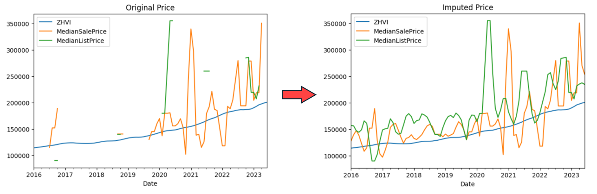
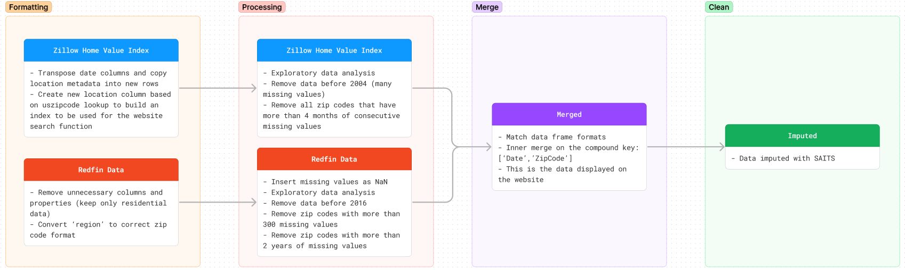

## Attention Please: Implementation of Self-Attention for Imputation of Time Series (SAITS) for Partially Observed Multivariate Real Estate Market Data
<i> A proof-of-concept using SAITS to impute missing values in publicly available time series data from Redfin and Zillow </i>

Missing values in publicly available datasets is a common problem in the real world. This becomes particularly concerning when trying to use this data for machine learning applications since many models cannot deal with missing data at all. To make these datasets useful, the missing data is typically removed or imputed using statistical techniques. Time series data is especially challenging to work with because removing a single missing value is not feasible. A data scientist must either remove the entire covariate, or the entire observed group from the data. This can lead to a massive loss of useful information and should be avoided wherever possible. Basic statistical techniques also have pitfalls. Filling in missing values with the mean, the last known value, or by doing linear interpolation will in fact complete the dataset, but aren’t always the best ways of making educated guesses. In a case where there are interrelated covariates (i.e. median listing price, number of homes sold, number of new listings, etc.), it is possible to use all known values of all covariates to make a better prediction for a missing value at any point in time. 

SAITS uses self-attention to capture long-range dependencies and relationships present in time series data. Self-attention is also one of the core components in the transformer model that has led to the recent AI frenzy (the “T” in “GPT” is for transformer). Time series analysis and natural language processing (NLP) are actually very similar. The order of words in a sentence is vital to understanding what that sentence means. The order of values in a time series dataset is equally as vital to understanding what that data means. Despite being completely overshadowed by NLP applications in chatbots, these self-attention mechanisms have shown great utility in the world of time series analysis.

Note: I wrote this code back in 2022, prior to the release of ChatGPT. None of the code or the documentation was written using AI. 

This project serves two purposes:
1.	To document backend procedures for aggregating data available at www.realestatetimeseries.com
2.	To clean and prepare data for time series forecasting

## Data Processing Pipeline
Each box corresponds to a Jupyter notebook in the notebooks folder, and its associated output is stored in the data folder (data folder not included on Github because the files are too large)

## Implementing SAITS

The following steps are done in the SAITS section of the notebooks folder:
1.	Graph time series and save data frames with different amounts of data missing so it is easy to look at the before and after results of imputation
2.	Create a custom artificial removal method to match the patterns in the observed data. There are many cases where there are consecutive missing values present in the data, so the removal method should attempt to match this so that the model can be optimize the correct objective
3.	Create a custom data loader to create training, validation, and testing sets in the format that SAITS needs to run
4.	Run SAITS and experiment with hyperparameters to get optimal results
5.	Create a baseline model with last observation carried forward (LOCF) to compare results
6.	Inverse transform and reconstruct the datasets to match their original format
7.	Graph final output

## Results

The final mean absolute error (MAE) on the testing set was 0.0725. This is substantially better than the naïve approach of LOCF, which produced an MAE of 0.3830 on the testing set. The final outputs show that the model was successful in identifying trends and imputing data accordingly. When data is filled with LOCF or another basic technique, it is very clear that the data is not real. These approaches will show a straight line in an otherwise chaotic chart and would introduce significant bias if the data was used for training a forecasting model. While SAITS will not remove all bias or solve every problem, it appears to be a more effective approach.

## Next Steps: Time Series Forecasting

The whole point of this project was to prepare data for time series forecasting by maximizing the retention of useful data, while also minimizing the bias introduced by imputation. the completed dataset can now be used in a forecasting model called the Temporal Fusion Transformer (TFT). Some of the code for this is included in the TFT section, but the results are not documented as it is beyond the scope of the imputation task.

## Sources 

[Wenjie Du, David Cote, and Yan Liu. SAITS: Self-Attention-based Imputation for Time Series. Expert Systems with Applications, 219:119619, 2023.](https://www.sciencedirect.com/science/article/abs/pii/S0957417423001203?via%3Dihub)
